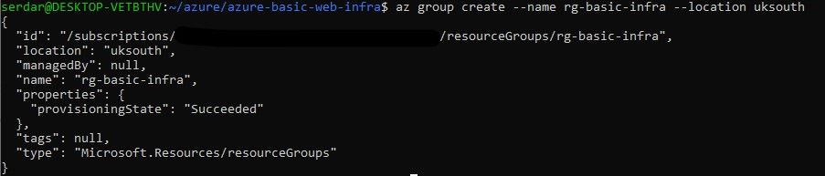
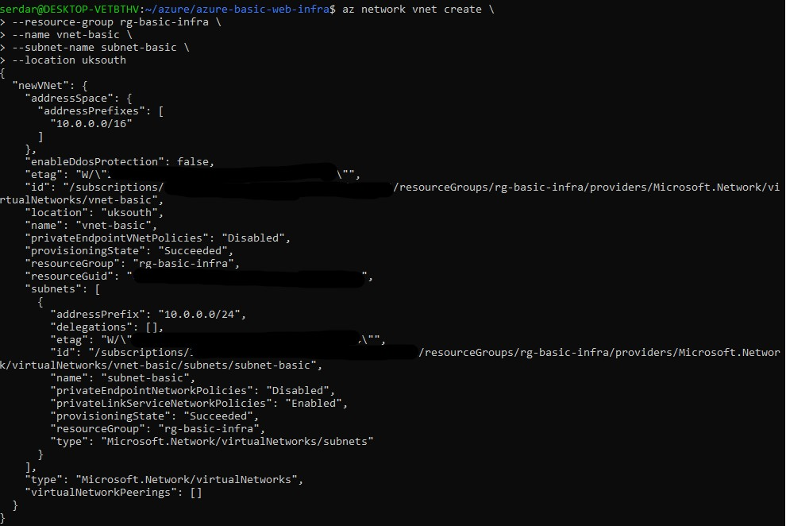
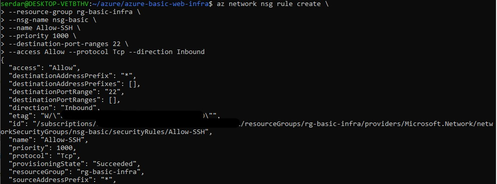
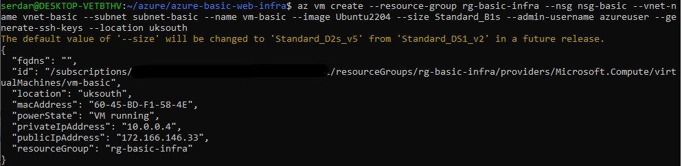
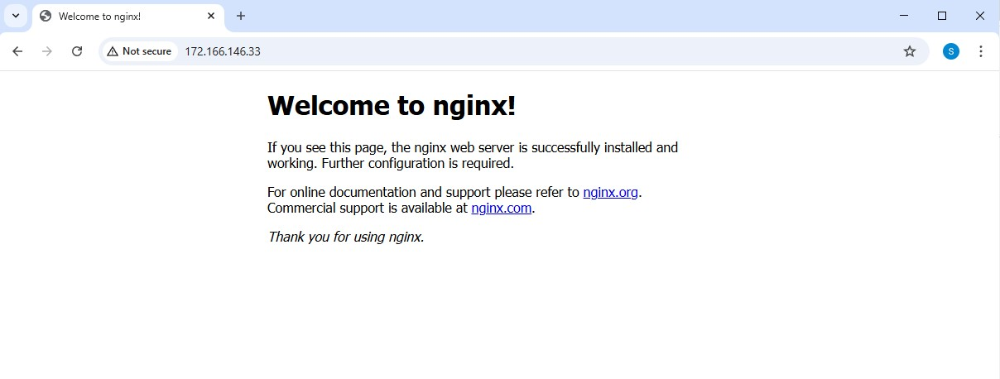
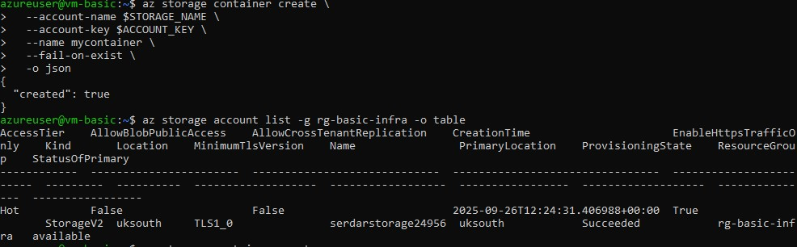
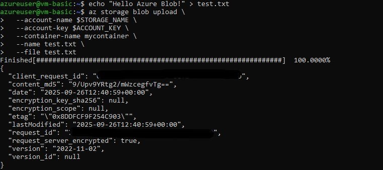
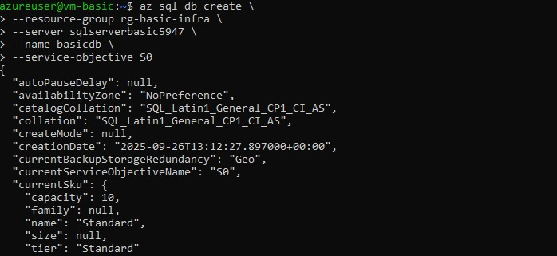

# Azure Mini Project

## Steps
1. Create Resource Group
2. Networking: VNet + Subnet + NSG
3. Deploy Linux VM + Install Web Server
4. Blob Storage
5. SQL Database
6. Azure Monitor

### 1. Create Resource Group
```bash
az group create --name rg-basic-infra --location uksouth
```


### 2. Networking: VNet + Subnet + NSG
```bash
az network vnet create \
  --resourcegroup rg-basic-infra \
  --name vnet-basic \
  --subnet-name subnet-basic \
  --location uksouth
```


SSH & HTTP Rules created

SSH rules


HTTP rules


### 3. Deploy Linux VM + Install Web Server

```
#Get public IP
az vm list-ip-addresses -g rg-basic-infra -n vm-basic -o table

#SSh into VM
ssh azureuser@<PUBLIC_IP>

#Inside VM - Install Nginx
sudo apt update && sudo apt install -y nginx
sudo systemctl enable nginx
sudo systemctl start nginx 
```

Welcome to Nginx!


### 4. Blob Storage
Create Storage Account


Create Account Key


Create storage container 



Upload a test file



### 5. SQL Database
Create SQL server 


Create SQL database



Connected with Azure Data Studio


### 6. Azure Monitor
Enabled monitoring + alert rule for CPU > 75%


