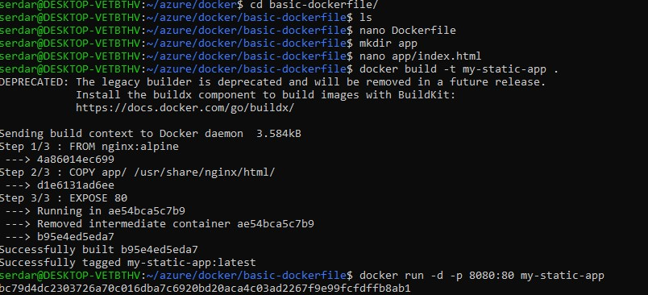
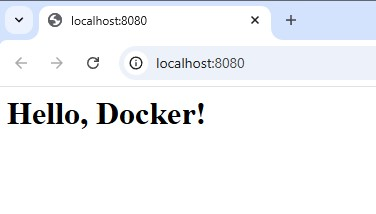

# Dockerfile Basics

## Install & Verify Docker
```bash
sudo apt update
sudo apt install docker.io -y
sudo systemctl enable --now docker
sudo usermod -aG docker $USER
```
Loguot/login and test 
```bash
docker --version
docker run hello-world
```
## Write a Basic Dockerfile
```dockerfile
# Base image
FROM nginx:alpine

# Copy app files to container
COPY app/ /usr/share/nginx/html/

# Expose port
EXPOSE 80

# Start Nginx (default CMD from base image)
```
## Build & Run Container
Build image:
```bash
docker build -t my-static-app .
```
Run container:
```bash
docker run -d -p 8080:80 my-static-app
```
Test in browser:
http://localhost:8080



