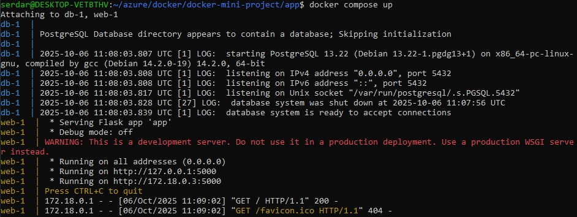
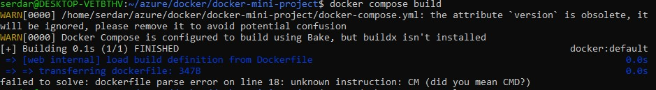

# Dockerized Flask App with Multi-Stage Build & PostgreSQL

A simple DevOps mini-project shows:
- Multi-stage Dockerfile build
- Docker Compose with Flask + PostgreSQL
- Networking and environment variables
- Image optimization

## Create the Flask APP
A minimal Flask app that returns a message when you open it in your browser.

```python
from flask import Flask
import os

app = Flask(__name__)

@app.route('/')
def home():
    return "Hello from Flask Docker Multi-Stage Build!"

if __name__ == '__main__':
    app.run(host='0.0.0.0', port=5000)
```

List the Python dependencies that Docker will use to install packages inside the container in a txt file(requirements.txt).

```nginx
flask
```
## Multi-Stage Dockerfile
A small, efficient container that builds dependencies once and produces a minimal runtime image.

```dockerfile
# Stage 1: Build stage
FROM python:3.9-slim AS builder

WORKDIR /app

# Copy requirements and install dependencies
COPY requirements.txt .
RUN pip install --no-cache-dir -r requirements.txt

# Stage 2: Final image
FROM python:3.9-alpine

WORKDIR /app

# Copy installed packages from builder stage
COPY --from=builder /usr/local/lib/python3.9/site-packages /usr/local/lib/python3.9/site-packages

# Copy app source code
COPY . .

EXPOSE 5000

CMD ["python", "app.py"]
```
## Create the YAML file
Create your docker compose yaml file

```yaml
services:
  web:
    build:
      context: ./app
      dockerfile: Dockerfile
    ports:
      - "5000:5000"
    depends_on:
      - db
    environment:
      - DATABASE_HOST=db
      - DATABASE_USER=user
      - DATABASE_PASSWORD=password
      - DATABASE_NAME=mydb

  db:
    image: postgres:13
    environment:
      POSTGRES_USER: user
      POSTGRES_PASSWORD: password
      POSTGRES_DB: mydb
    volumes:
      - db_data:/var/lib/postgresql/data

volumes:
  db_data:
```
## Build & Run the Project
Build your containers with docker compose.

```bash
docker compose build
```


Use '-d'(detached mode) option if you want to run your container in the background.

```bash
docker compose up
```


Access you app at:
http://localhost:5000


Check running containers:

```bash
docker ps
```

Stop everything:

```bash
docker compose down
```
## Errors That I Get During The Project
Misspelling in the Dockerfile and an obsolete attribute in the YAML file
- The obsolete attribute is removed
- The misspelling is corrected



Misspelling in the Python file
- The misspelling is corrected


