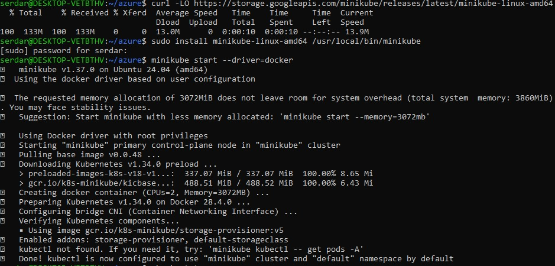

# Kubernetes Fundamentals
1- Install a local Kuberenetes cluster(minikube)
2- kuebctl basics:
  - Pods
  - Deployments
  - Services
3-Cluster resources

## Install Kubernetes Locally
Minikube is a lightweighted tool that lets you run a single-node Kubernetes cluster locally.

Install a minikube
```bash
curl -LO https://storage.googleapis.com/minikube/releases/latest/minikube-linux-amd64
sudo install minikube-linux-amd64 /usr/local/bin/minikube
```
Start a cluster
```bash
minikube start --driver=docker
```

Check status
```bash
minikube status
```


## Install and Verify kubectl Setup
Install via Snap
```bash
sudo snap install kubectl --classic
```
Verify installation
```bash
kubectl version --client
```
Check cluster info
```bash
kubectl cluster-info
```
Check nodes
```bash
kubectl get nodes
```


## Explore Pods
A Pod is the smallest deployable unit in Kubernetes. 

Create a test Pod with nginx
```bash
kubectl run nginx-test --image=nginx --restart=Never
```
List Pods
```bash
kubectl get pods
```

Describe a Pod with detailed info
```bash
kubectl describe pod nginx-test
```


## Explore Deployments
A Deployment manages Pods and ensures the desired number of replicas are running

Create a Deployment with nginx
```bash
kubectl create deployment nginx-deploy --image=nginx
```
List Deployments
```bash
kubectl get deployments
```
List Pods created by the Deployment
```bash
kubectl get pods
```
Scale Deployment
```bash
kubectl scale deployment nginx-deploy --replicas=3
kubectl get pods
```


## Explore Services
A Service exposes Pods to the network. For example, a ClusterIP service is internal, and a NodePort service exposes it externally

Expose Deployment as a Service(NodePort)
```bash
kubectl expose deployment nginx-deploy --type=NodePort --port=80
```
List Services
```bash
kubectl get services
```
Get NodePort URL
```bash
minikube service nginx-deploy --url
```


## Cleanup

```bash
kubectl delete pod nginx-test
kubectl delete deployment nginx-deploy
kubectl delete service nginx-deploy
```


