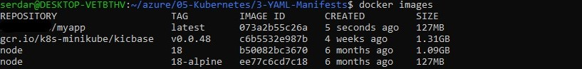
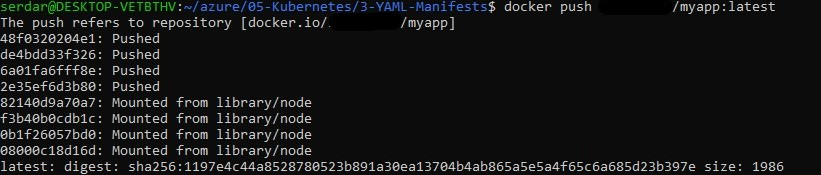
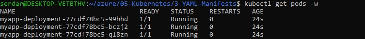
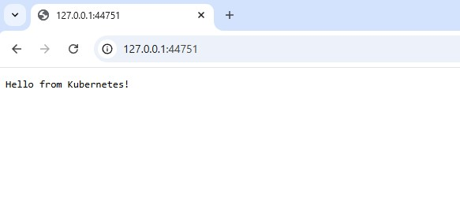

# Kubernetes Manifests
1. Declarative configuration with YAML
2. Deployments for managing replicas and rollouts
3. Services for stable networking and load balancing

## Create Minimal Node.js App
index.js
```javascript
const http = require('http');
const PORT = 80;

const server = http.createServer((req, res) => {
  res.writeHead(200, {'Content-Type': 'text/plain'});
  res.end('Hello from Kubernetes!');
});

server.listen(PORT, () => {
  console.log(`Server running on port ${PORT}`);
});
```
package.json
```bash
npm init -y
```
## Create Dockerfile
```dockerfile
FROM node:18-alpine
WORKDIR /usr/src/app
COPY package*.json ./
RUN npm install
COPY . .
EXPOSE 80
CMD ["node", "index.js"]
```

## Build Docker Image
Login Docker Hub
```bash
docker login
```
Build and tag your image(with your Docker Hub username)
```bash
docker build -t username/myapp:latest .
```
Check the image exists
```bash
docker images
```

## Push Image to Docker Hub
```bash
docker push username/myapp:latest
```

## Create YAML Files
Deployment YAML(deployment.yaml)
```yamlapiVersion: apps/v1
kind: Deployment
metadata:
  name: myapp-deployment
  labels:
    app: myapp
spec:
  replicas: 3
  selector:
    matchLabels:
      app: myapp
  template:
    metadata:
      labels:
        app: myapp
    spec:
      containers:
      - name: myapp
        image: username/myapp:latest
        ports:
        - containerPort: 80
```
Service YAML(service.yaml)
```yaml
apiVersion: v1
kind: Service
metadata:
  name: myapp-service
  labels:
    app: myapp
spec:
  type: NodePort
  selector:
    app: myapp
  ports:
    - port: 80
      targetPort: 80
      nodePort: 30007
```
## Deploy to Kubernetes and Access the App
Deploy to Kubernetes
```bash
kubectl apply -f deployment.yaml
kubectl apply -f service.yaml
kubectl get pods -w
```


Access the App with --url flag to get the URL without attempting to open it.
```bash
minikube service myapp-service --url
```


Cleanup
```bash
kubectl delete deployment myapp-deployment
kubectl delete service myapp-service
docker rmi username/myapp:latest
```

