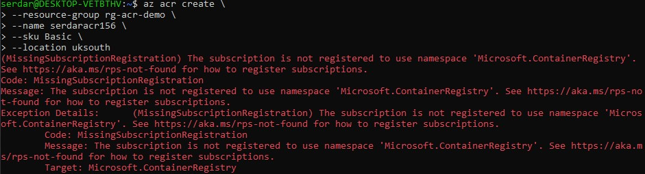
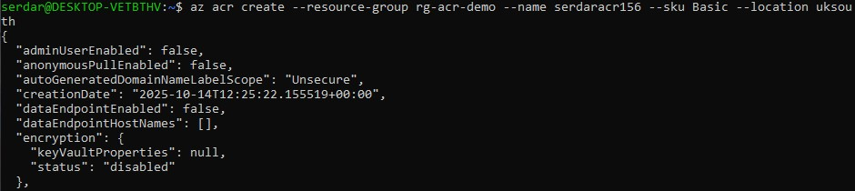
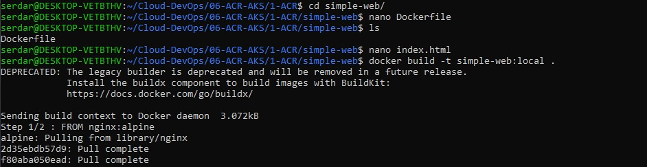
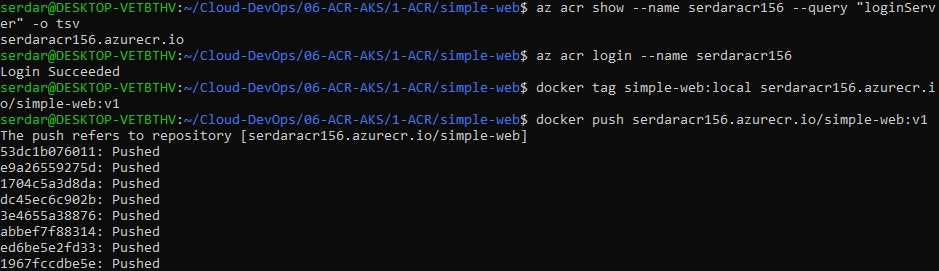
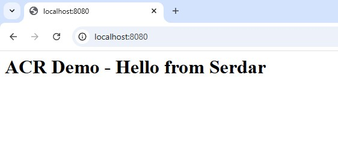

# Azure Container Registery
1. Create a resource group
2. Create an ACR (sku Basic)
3. Build a small Docker image locally
4. Log in to ACR and push the image
5. Pull it back to verify

## Login to Azure and Create a Resource Group
```bash
az login --use-device-code
az group create --name rg-acr-demo --location uksouth
```

## Create the ACR (Basic SKU)
Choose a regisry name.
```bash
az acr create --resource-group rg-acr-demo --name yournameacr123 --sku Basic --location uksouth
```
I get 'MissingSubscriptionRegistration' error. The resource provider must be enabled for the subscription

I registered the Microsoft.ContainerRegistry resource provider for my subscription
```bash
az provider register --namespace Microsoft.ContainerRegistry
```
Created Basic sku


## Build a Small Docker Image
Created a folder for my simple-web app
Created Dockerfile and index.html file in html folder
```Dockerfile
FROM nginx:alpine
COPY ./html /usr/share/nginx/html
```
```html
<!-- simple-web/html/index.html -->
<html><body><h1>ACR Demo - Hello from yourusername</h1></body></html>
```
Built Dokcer image locally
```bash
docker build -t simple-web:local .
```


## Tag the Image for ACR and Push
Get the login server name:
```bash
az acr show --name yournameacr123 --query "loginServer" -o tsv
# => yournameacr123.azurecr.io
```
Login with you Azure credentials to set Docker credentials appropriately
```bash
az acr login --name yournameacr123
```
Tag and push
```bashdocker tag simple-web:local yournameacr123.azurecr.io/simple-web:v1
docker push yournameacr123.azurecr.io/simple-web:v1
```


## Verify & Pull
List repositories
```bashaz acr repository list --name yournameacr123 -o table
az acr repository show-tags --name yournameacr123 --repository simple-web -o table
```
Pull to verify
```bash
docker pull yournameacr123.azurecr.io/simple-web:v1
docker run --rm -p 8080:80 yournameacr123.azurecr.io/simple-web:v1
```

Open it on your browser to see the page
http://localhost:8080

