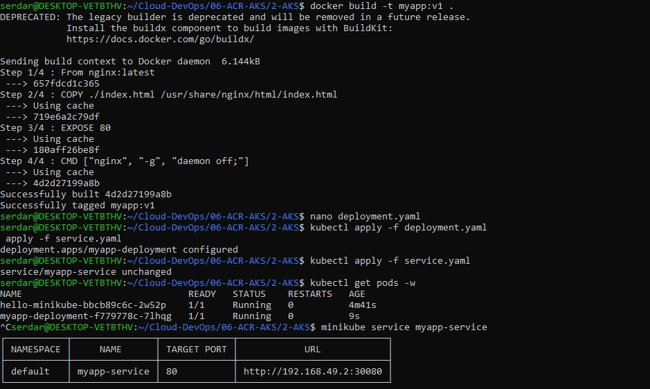
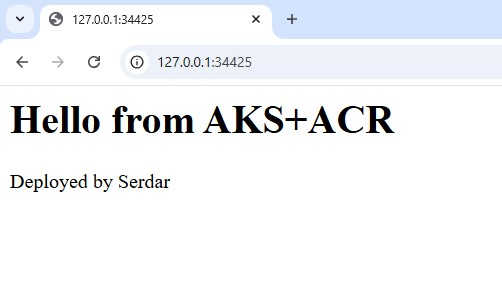
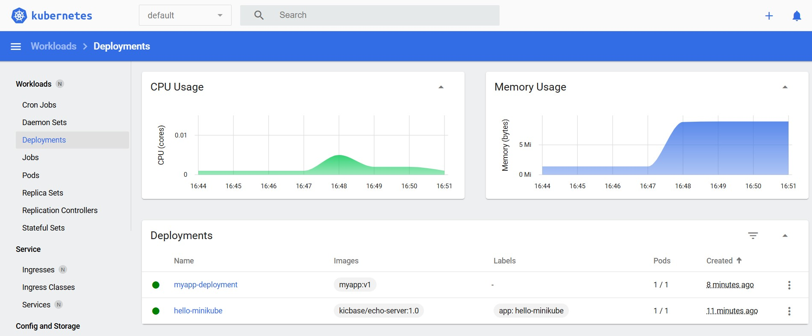

# Azure Kubernetes Service
I use local kubernetes environment, because my free trail credit has been expired at the end of the 1 month.

## Local Kubernetes (minikube)
To mimic AKS without using Azure credits:

1. Docker: build images locally.
2. Kubernetes: deploy the app using deployment.yaml and service.yaml files.
3. Dashboard: verify pods and services visually
4. NodePort service: access the app locally (simulates LoadBalancer in AKS)

## Build Image and Deploy Manifests
Created Dockerfile, deployment and service yaml files, basic html file.
- Minikube Docker environment
```bash
eval $(minikube docker-env)
```
- Built the image 
```bash
docker build -t myapp:v1 .
```
- Checked pods
```bash
kubectl get pods -w
```
- Opened the service
```bash
minikube service myapp-service
```




## Kubernetes Minikube Addons
```bash
minikube addons enable metrics-server
minikube addons enable dashboard
```
To open dashboard
```bash
minikube dashboard
```

