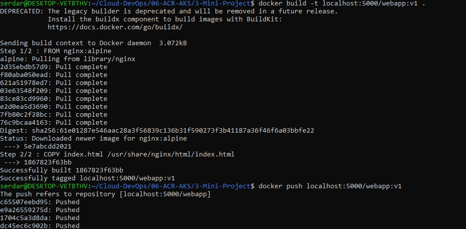
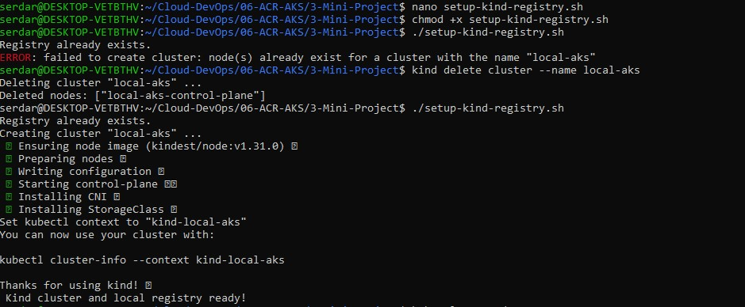
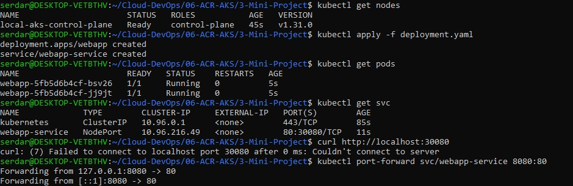
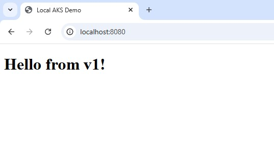
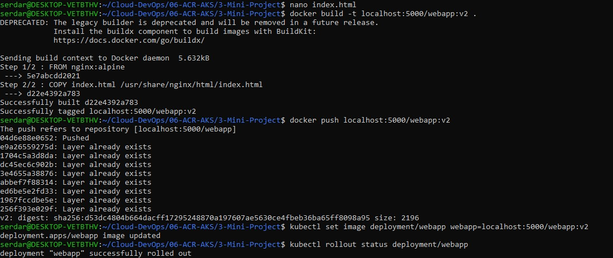
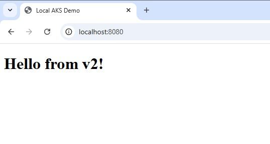

# Mini Project ACR-AKS
1. Create a local Kubernetes cluster
2. Create a local registry to mimic ACR
3. Create a simple web app for containerization
4. Connect Kind to the local registry
5. Deploy the app from registry to Kubernetes
6. Simulate a rolling update

## Create a Local Cluster and Registry
```bash
kind create cluster --name local-aks
kubectl get nodes
```
I have a local Kubernetes cluster like a free AKS.

Kind uses Docker containers as cluster nodes.

Run the Docker registry container on port 5000:
```bash
docker run -d -p 5000:5000 --restart=always --name local-registry registry:2
```
This acts like ACR, so I can push and pull images to localhost:5000.

To test; should return {}
```bash
curl http://localhost:5000/v2/
```

## Create a Simple Webapp
Create an index.html
```html
<!DOCTYPE html>
<html>
  <head><title>Local AKS Demo</title></head>
  <body>
    <h1>Hello from v1!</h1>
  </body>
</html>
```

Create a Dockerfile
```dockerfile
FROM nginx:alpine
COPY index.html /usr/share/nginx/html/index.html
```

Build and tag the image for the local registry
```bash
docker build -t localhost:5000/webapp:v1 .
```

Push it to the local registry
```bash
docker push localhost:5000/webapp:v1
```


List images stored in the registry. Should returnl {"repositories":["webapp"]}
```bash
curl http://localhost:5000/v2/_catalog
```

## Connect Kind to The Local Registry
Create setup-kind-registry.sh file
```bash
#!/bin/bash
# setup-kind-registry.sh
set -e

# Create local registry if not exists
reg_name='local-registry'
reg_port='5000'
if [ "$(docker ps -aq -f name=$reg_name)" ]; then
  echo "Registry already exists."
else
  docker run -d -p ${reg_port}:5000 --restart=always --name ${reg_name} registry:2
fi

# Create kind cluster with registry mirror
cat <<EOF | kind create cluster --name local-aks --config=-
kind: Cluster
apiVersion: kind.x-k8s.io/v1alpha4
containerdConfigPatches:
- |-
  [plugins."io.containerd.grpc.v1.cri".registry.mirrors."localhost:${reg_port}"]
    endpoint = ["http://${reg_name}:${reg_port}"]
EOF

# Connect registry to kind network
docker network connect "kind" "${reg_name}" || true

echo " Kind cluster and local registry ready!"
```

Make it executable and run.
```bash
chmod +x setup-kind-registry.sh
./setup-kind-registry.sh
```
I get an error "failed to create cluster", because I already had a Kind cluster name local-aks.

Delete the existing cluster and run the script again
```bash
kind delete cluster --name local-aks
```


## Deploying the App From Registry to Kubernetes
Create a Kubernetes Deployment manifest deployment.yaml, then apply it.
```bash
kubectl apply -f deployment.yaml
kubectl get pods
kubectl get svc
```
Forward port and keep the terminal open.
```bash
kubectl port-forward svc/webapp-service 8080:80
```


In a new terminal, test the app
```bash
curl http://localhost:8080
```

## Simulate a Rolling Update
Update your index.html
Build and push new Docker image
```bash
docker build -t localhost:5000/webapp:v2 .
docker push localhost:5000/webapp:v2
```
Update the deployment
```bash
kubectl set image deployment/webapp webapp=localhost:5000/webapp:v2
kubectl rollout status deployment/webapp
```

Verify
```bash
curl http://localhost:8080
```



