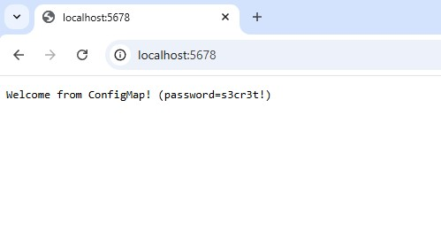
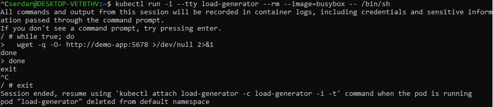
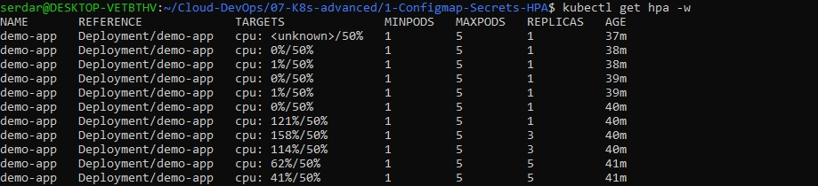

# Configmap, Secrets and HPA
Using YAML for configuration as code, managing secrets securely, and enabling autoscaling help ensure resilient and repeatable infrastructure.

## Create Kind Cluster
Install kind, then;
```bash
kind create cluster
kubectl cluster-info --context kind-kind
```

## Install metrics-server
Required for HPA
```bash
kubectl apply -f https://github.com/kubernetes-sigs/metrics-server/releases/latest/download/components.yaml
```
```bash
kubectl top nodes
```
I get "error: Metrics API not available"

Tried to fix with a local temporary metrics-server.yaml for minikube/local clusters/WSL2.

Then I get x509 error.

ImagePullbackOff error; Kubernetes couldn't pull the metrics-server image.

I had multiple metrics-server pods failing to pull the image
```pgsql
metrics-server-7894c57876-w4q2k  0/1  ImagePullBackOff
metrics-server-5dd7f7f59c-2ndsj   0/1  Running
```
Then a CrashLoopBackOff error.

```pgsql
panic: error creating self-signed certificates: mkdir apiserver.local.config: permission denied
```
Finally, I used the official Kind "metrics-server" workaround
```bash
kubectl delete deployment metrics-server -n kube-system
```

Applied the Kind-specific manifest directly from Github
```bash
kubectl apply -f https://github.com/kubernetes-sigs/metrics-server/releases/latest/download/components.yaml
```
Edited the deployment to add the required args inside Kind
```bash
kubectl -n kube-system edit deployment metrics-server
```
Under container.args, added;
```diff
--kubelet-insecure-tls
--kubelet-preferred-address-types=InternalIP
--cert-dir=/tmp
```
Restarted the deployment
```bash
kubectl rollout restart deployment metrics-server -n kube-system
```
Checked status
```bash
kubectl get pods -n kube-system -w
kubectl top nodes
```
## Create and Apply YAML Files
- ConfigMap (configmap.yaml)
```yaml
apiVersion: v1
kind: ConfigMap
metadata:
  name: demo-config
data:
  WELCOME_MSG: "Welcome from ConfigMap!"
  CONFIG_JSON: |
    { "mode": "demo", "featureX": true }
```
- Secret (secret.yaml)
```yaml
apiVersion: v1
kind: Secret
metadata:
  name: demo-secret
type: Opaque
stringData:
  DB_PASSWORD: "s3cr3t!"
```
- Deployment using both (deployment.yaml)
```yaml
apiVersion: apps/v1
kind: Deployment
metadata:
  name: demo-app
spec:
  replicas: 1
  selector:
    matchLabels:
      app: demo
  template:
    metadata:
      labels:
        app: demo
    spec:
      containers:
      - name: demo
        image: hashicorp/http-echo:0.2.3
        args:
          - "-text=$(WELCOME_MSG) (password=$(DB_PASSWORD))"
        envFrom:
          - configMapRef:
              name: demo-config
          - secretRef:
              name: demo-secret
        ports:
        - containerPort: 5678
```
- Apply;
```bash
kubectl apply -f configmap.yaml
kubectl apply -f secret.yaml
kubectl apply -f deployment.yaml
kubectl expose deployment demo-app --type=NodePort --port=5678
kubectl port-forward svc/demo-app 5678:5678
```


## Scaling and HPA
- Manuel scale;
```bash
kubectl scale deployment demo-app --replicas=3
kubectl get pods -l app=demo
```

- HPA autoscale based on CPU usage;
Add CPU requests to container with modifying deployment.yaml container spec to include;
```yaml
resources:
  requests:
    cpu: 100m
  limits:
    cpu: 250m
```
- Create HPA
```bash
kubectl autoscale deployment demo-app --cpu-percent=50 --min=1 --max=5
kubectl get hpa
```

- Generate load to test;
Use a simple BusyBox pod to generate load
```bash
kubectl run -i --tty load-generator --rm --image=busybox -- /bin/sh
```
Stress the demo-app CPU
```bash
while true; do
  wget -q -O- http://demo-app:5678 >/dev/null 2>&1
done
```
Monitor HPA scaling
```bash
kubectl get hpa -w
```






