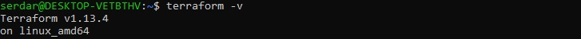
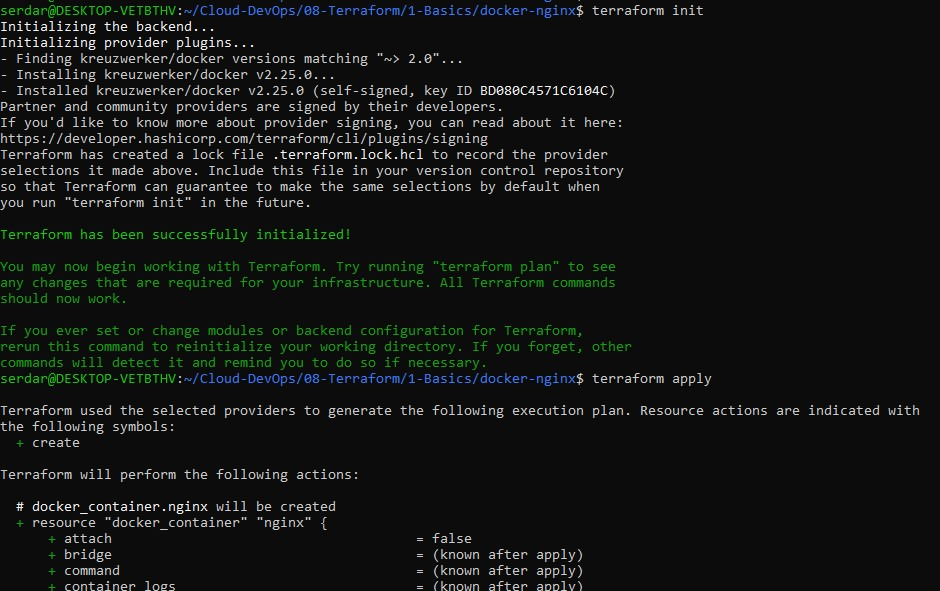
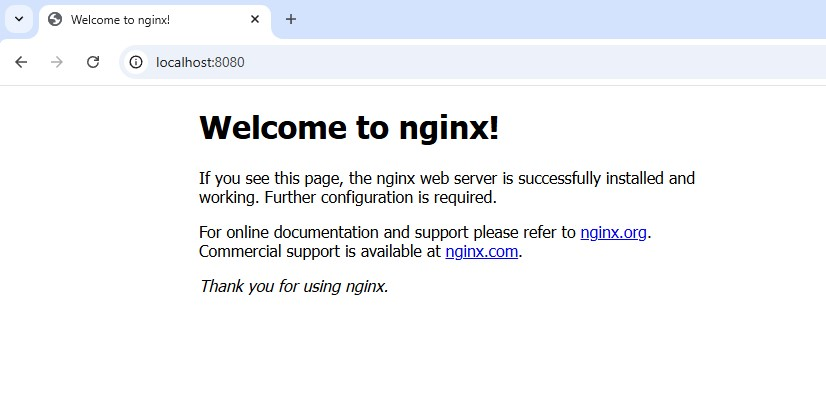

# Terraform Basics
- Install Terraform on Ubuntu via HashiCorp apt repo
- Create a basic nginx demo and main.tf file
- Run the Docker Terraform example

## Install Terraform
Commands to install latest Terraform via HashiCorp apt repo
```bash
# Update packages
sudo apt update && sudo apt install -y gnupg software-properties-common curl

# Add HashiCorp GPG and repo
curl -fsSL https://apt.releases.hashicorp.com/gpg | sudo gpg --dearmor -o /usr/share/keyrings/hashicorp-archive-keyring.gpg
echo "deb [signed-by=/usr/share/keyrings/hashicorp-archive-keyring.gpg] https://apt.releases.hashicorp.com $(lsb_release -cs) main" | \
  sudo tee /etc/apt/sources.list.d/hashicorp.list

# Install Terraform
sudo apt update && sudo apt install -y terraform

# Verify
terraform -v
```


## Local Practice
Practice the full Terraform cycle locally by managing Docker containers with Terraform. This includes;
- Terraform structure (init, plan, apply)
- Interpolation
- Outputs
- Variables

Create a new directory for demo app and main.tf file

```bash
mkdir docker-nginx
cd docker-nginx
nano main.tf
```
Terraform Docker example;
```hcl
# terraform/docker-nginx/main.tf
terraform {
  required_providers {
    docker = {
      source  = "kreuzwerker/docker"
      version = "~> 2.0"
    }
  }
}

provider "docker" {}

resource "docker_image" "nginx" {
  name = "nginx:latest"
}

resource "docker_container" "nginx" {
  name  = "tf-nginx"
  image = docker_image.nginx.latest
  ports {
    internal = 80
    external = 8080
  }
}
```
Run it;
```bash
terraform init
terraform apply
# Visit http://localhost:8080 to see nginx default page
```




Destroy;
```bash
terraform destroy
```

