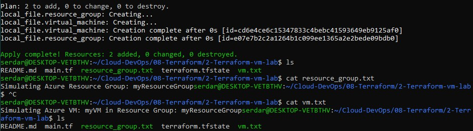

# Terraform - Deploy Resource Group & VM
Use Terraform to define infrastructure (local & Azure)
- Simulated Azure infra locally using the `local` provider.
- Understood Terraform workflow (`init`, `plan`, `apply`).
- Reviewed Azure-specific Terraform config for real deployment.

## Initialize a Terraform Project

Created a directory for new lab

```bash
mkdir Terraform-vm-lab && cd Terraform-vm-lab
```
Inside it, created the main file;

```bash
nano main.tf
```
Used the local provider to mimic infrastructure creation
```hcl
terraform {
  required_providers {
    local = {
      source = "hashicorp/local"
      version = "~> 2.5"
    }
  }
}

provider "local" {}

# Resource Group creation
resource "local_file" "resource_group" {
  content  = "Simulating Azure Resource Group: myResourceGroup"
  filename = "${path.module}/resource_group.txt"
}

# Virtual Machine
resource "local_file" "virtual_machine" {
  content  = "Simulating Azure VM: myVM in Resource Group: myResourceGroup"
  filename = "${path.module}/vm.txt"
}
```

`Ctrl+O` to save and `Ctrl+X` to exit

Then ran;

```bash
terraform init
terraform plan
terraform apply -auto-approve
```
Checked created files

```bash
cat resource_group.txt
cat vm.txt
```



Azure Version

```hcl
#The provider tells Terraform which cloud it should talk to
provider "azurerm" {
  features {}
}

#Define resources
resource "azurerm_resource_group" "rg" {
  name     = "myResourceGroup"
  location = "West Europe"
}

#Virtual Network + SubNet
resource "azurerm_virtual_network" "vnet" {
  name                = "myVNet"
  address_space       = ["10.0.0.0/16"]
  location            = azurerm_resource_group.rg.location
  resource_group_name = azurerm_resource_group.rg.name
}

resource "azurerm_subnet" "subnet" {
  name                 = "mySubnet"
  resource_group_name  = azurerm_resource_group.rg.name
  virtual_network_name = azurerm_virtual_network.vnet.name
  address_prefixes     = ["10.0.1.0/24"]
}

resource "azurerm_network_interface" "nic" {
  name                = "myNIC"
  location            = azurerm_resource_group.rg.location
  resource_group_name = azurerm_resource_group.rg.name

  ip_configuration {
    name                          = "internal"
    subnet_id                     = azurerm_subnet.subnet.id
    private_ip_address_allocation = "Dynamic"
  }
}

#Linux VM
resource "azurerm_linux_virtual_machine" "vm" {
  name                = "myVM"
  resource_group_name = azurerm_resource_group.rg.name
  location            = azurerm_resource_group.rg.location
  size                = "Standard_B1s"
  admin_username      = "azureuser"

  network_interface_ids = [azurerm_network_interface.nic.id]

  admin_ssh_key {
    username   = "azureuser"
    public_key = file("~/.ssh/id_rsa.pub")
  }

  os_disk {
    caching              = "ReadWrite"
    storage_account_type = "Standard_LRS"
  }

  source_image_reference {
    publisher = "Canonical"
    offer     = "UbuntuServer"
    sku       = "18.04-LTS"
    version   = "latest"
  }
}
```
To destroy;
```bash
terraform destroy
```


