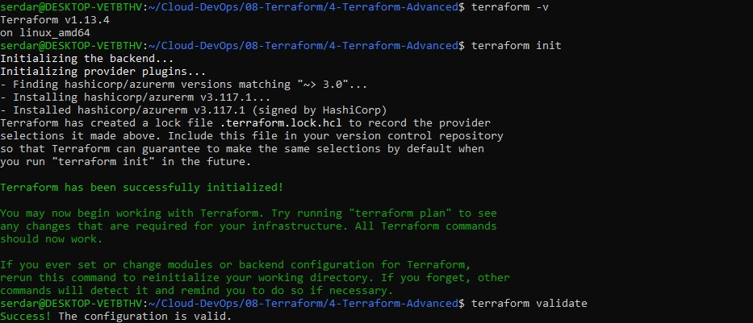

# Terraform Advanced: Azure SQL and Blob Storage
Define Azure SQL Database and Blob Storage using Terraform

## Initialize the Terraform Project
Created a `main.tf` file base setup to declare the Azure provider and a single resource group. The `features {}` block is required even if empty.

```hcl
terraform {
  required_providers {
    azurerm = {
      source  = "hashicorp/azurerm"
      version = "~> 3.0"
    }
  }
}

provider "azurerm" {
  features {}
}

# Resource Group
resource "azurerm_resource_group" "rg" {
  name     = var.resource_group_name
  location = var.location
}
```
## Add Azure SQL Database Resources
- `azurerm_mssql_server` is a logical server, not a VM.

- `sku_name` defines performance tier (S0 = basic production-grade).

- Terraform automatically creates dependencies (DB waits for Server).

Appended to `main.tf`:

```hcl
# SQL Server
resource "azurerm_mssql_server" "sql_server" {
  name                         = var.sql_server_name
  resource_group_name          = azurerm_resource_group.rg.name
  location                     = azurerm_resource_group.rg.location
  administrator_login          = var.sql_admin_login
  administrator_login_password = var.sql_admin_password
  version                      = "12.0"
}

# SQL Database
resource "azurerm_mssql_database" "sql_db" {
  name      = var.sql_db_name
  server_id = azurerm_mssql_server.sql_server.id
  sku_name  = "S0"
}
```
## Add Storage Account and Blob Container
- `LRS` = Locally Redundant Storage (cheapest, one region).

- Containers hold blobs (files); the access type can be `private`, `blob`, or `container`.

Appended to `main.tf`:

```hcl
# Storage Account
resource "azurerm_storage_account" "storage" {
  name                     = var.storage_account_name
  resource_group_name      = azurerm_resource_group.rg.name
  location                 = azurerm_resource_group.rg.location
  account_tier             = "Standard"
  account_replication_type = "LRS"
}

# Blob Container
resource "azurerm_storage_container" "container" {
  name                  = var.storage_container_name
  storage_account_name  = azurerm_storage_account.storage.name
  container_access_type = "private"
}
```
## Define Variables
Used variables for all changeable values so I can reuse the same Terraform code later in other environments.

Created `variables.tf`:

```hcl
variable "resource_group_name" {
  default = "tf-advanced-rg"
}

variable "location" {
  default = "West Europe"
}

variable "sql_server_name" {
  default = "tf-sqlserver-demo"
}

variable "sql_admin_login" {
  default = "sqladminuser"
}

variable "sql_admin_password" {
  default = "Password123!"
}

variable "sql_db_name" {
  default = "tf-sample-db"
}

variable "storage_account_name" {
  default = "tfstorageexample123"
}

variable "storage_container_name" {
  default = "appdata"
}
```
## Define Outputs
Outputs print resource information after deployment.

Created `outputs.tf`:

```hcl
output "sql_server_name" {
  value = azurerm_mssql_server.sql_server.name
}

output "sql_database_name" {
  value = azurerm_mssql_database.sql_db.name
}

output "storage_account_name" {
  value = azurerm_storage_account.storage.name
}

output "storage_container_name" {
  value = azurerm_storage_container.container.name
}
```
## Local Validation
```bash
terraform -v
terraform init
terraform validate
```

