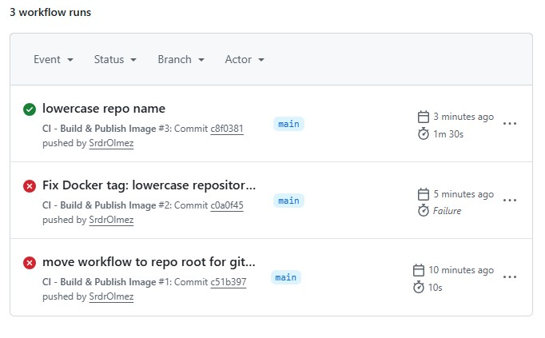
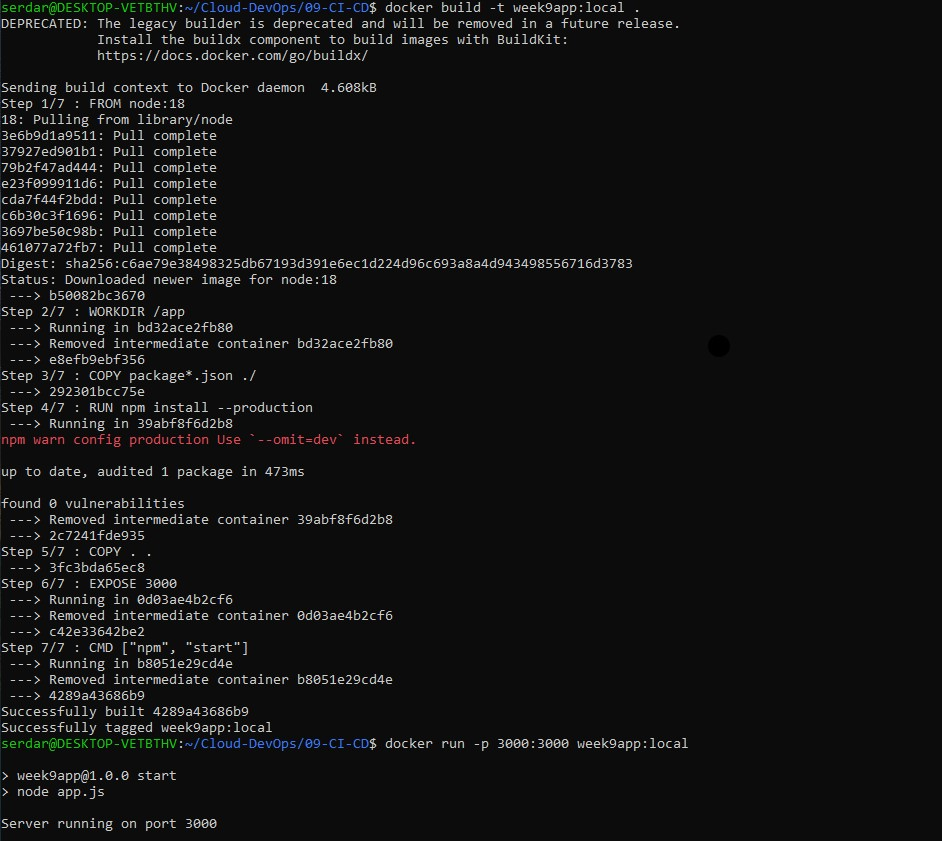
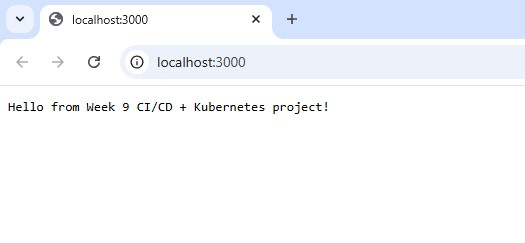

# CI/CD Pipeline
This project demonstrated a CI/CD workflow using GitHub Actions:

- Builds Docker image from `09-CI-CD/Dockerfile`
- Pushes image to Github Container Registry

## Github Actions

## Docker Image

