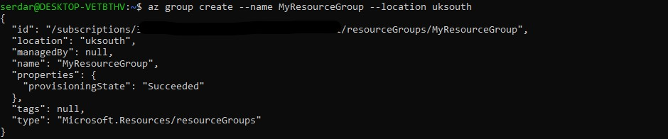

# Create Resource Group

## Login
```bash
az login --use-device-code
```


## Create Resource Group
```bash
az group create --name MyResourceGroup --location uksouth 
```
I use 'uksouth' as location because 'westeurope' servers are generally busy.



