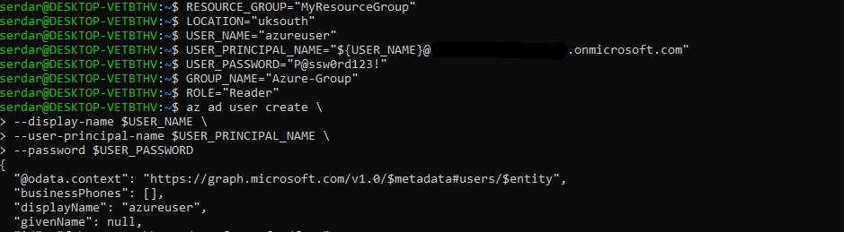
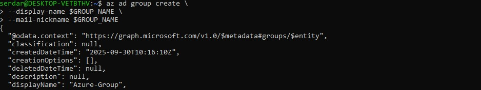
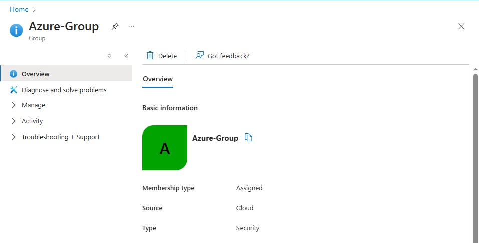
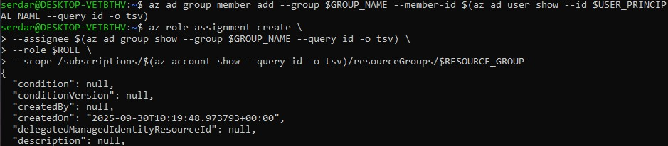

# Azure Entra ID Users/Groups/RBAC 

## Create Variables 
```bash
# Lab Variables
RESOURCE_GROUP="MyResourceGroup"
LOCATION="uksouth"
USER_NAME="azureuser"
USER_PRINCIPAL_NAME="${USER_NAME}@<yourtenant>.onmicrosoft.com"   # Replace <yourtenant>
USER_PASSWORD="P@ssw0rd123!"  
GROUP_NAME="Azure-group"
ROLE="Reader"   # Or Contributor etc.
```

## Create User in Entra ID
```bash
az ad user create \
  --display-name $USER_NAME \
  --user-principal-name $USER_PRINCIPAL_NAME \
  --password $USER_PASSWORD
```


## Create Group
```bash
az ad group create \
  --display-name $GROUP_NAME \
  --mail-nickname $GROUP_NAME
```


Group overview on azure portal



## Add User to Group and Assign Role
Add user to Group
```bash
az ad group member add \
  --group $GROUP_NAME \
  --member-id $(az ad user show --id $USER_PRINCIPAL_NAME --query id -o tsv)
```
Assign RBAC
```bash
az role assignment create \
  --assignee $(az ad group show --group $GROUP_NAME --query id -o tsv) \
  --role $ROLE \
  --scope /subscriptions/$(az account show --query id -o tsv)/resourceGroups/$RESOURCE_GROUP
```


Overview on azure portal


