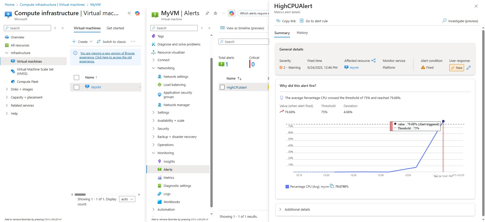
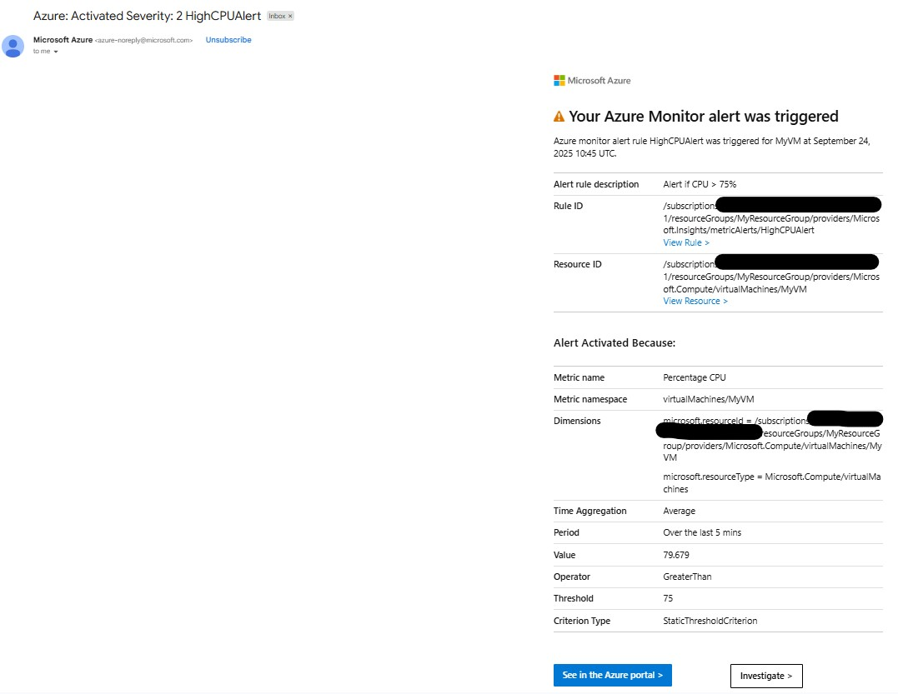

#  Azure Monitor & CPU Alerts Lab

## Objective
The goal of this lab was to learn how to deploy a Linux VM in Azure, configure networking, monitor CPU usage, create an Action Group, and set up an alert to notify via email when CPU exceeds a threshold.

---

## Key Concepts Covered

### 1. Network Security Group (NSG)
- Rules cannot have the same priority and direction.
- SSH (port 22) and HTTP (port 80) were opened with unique priorities.

### 2. Azure Monitor & Action Groups
- **Action Groups** are collections of notification preferences and actions.
- Configured an **email Action Group** to receive notifications when an alert triggers.
- Learned that:
  - Some Azure resources require the provider `Microsoft.Insights` to be registered.
  - Action Groups may need to be deployed in the `global` location depending on region.

### 3. CPU Alert Rules
- Created a **CPU usage alert** on the VM.
- Learned:
  - How to monitor metrics like **Percentage CPU**.
  - How alerts evaluate metrics periodically (every minute).
  - Linking an alert to an Action Group triggers notifications when conditions are met.

### 4. Stress Testing the VM
- Used the `stress` tool to simulate high CPU load:
  - `--cpu` spins CPU-intensive workers.
  - Other options (`--io`, `--vm`, `--hdd`) simulate disk and memory load.
- Verified that alerts would trigger under high CPU usage.

## Screenshots

1. CPU Alert rule configuration
2. CPU spike in Metrics (Monitor → Metrics → VM → Percentage CPU)
3. Email notification

