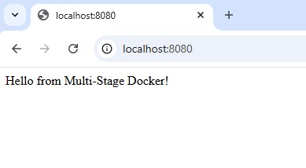

# Multistage Compose
I use one container to build and another lightweight container to run the app. This makes final image smaller, faster and cleaner.

## Creating a Basic Webpage
Create a server.js file
```js
const express = require('express');
const app = express();
const PORT = 3000;

app.get('/', (req, res) => {
  res.send('Hello from Multi-Stage Docker!');
});

app.listen(PORT, () => {
  console.log(`App running at http://localhost:${PORT}`);
});
```
Create a package.json file
```json
{
  "name": "multi-stage-demo",
  "version": "1.0.0",
  "main": "server.js",
  "dependencies": {
    "express": "^4.18.2"
  }
}
```
## Creating Multi-Stage Dockerfile
```dockerfile
# Stage 1: Build
FROM node:18 as builder
WORKDIR /app
COPY package*.json ./
RUN npm install
COPY . .

# Stage 2: Run (lightweight)
FROM node:18-alpine
WORKDIR /app
COPY --from=builder /app .
EXPOSE 3000
CMD ["node", "server.js"]
```
### Run & Test
```bash
# Build image
docker build -t multi-stage-demo .

# Run container
docker run -d -p 3000:3000 multi-stage-demo

# Test in browser
http://localhost:3000
```
## Docker Compose 
Create the yaml file
```yaml
version: "3.8"
services:
  app:
    build: .
    ports:
      - "8080:3000"
    depends_on:
      - db
    environment:
      - DB_HOST=db
      - DB_USER=root
      - DB_PASSWORD=rootpass
      - DB_NAME=mydb

  db:
    image: mysql:8
    restart: always
    environment:
      MYSQL_ROOT_PASSWORD: rootpass
      MYSQL_DATABASE: mydb
    volumes:
      - db_data:/var/lib/mysql

volumes:
  db_data:
```
### Run & Test 
```bash
# Start services
docker-compose up -d

# List running containers
docker ps

# Access app
http://localhost:3000

# Stop services
docker-compose down
```


